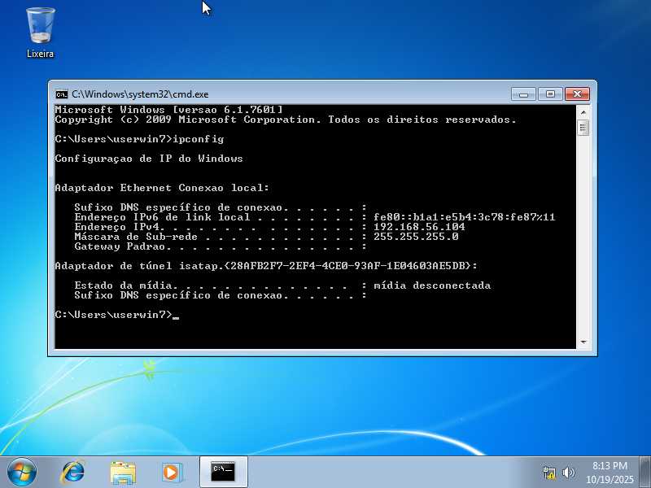
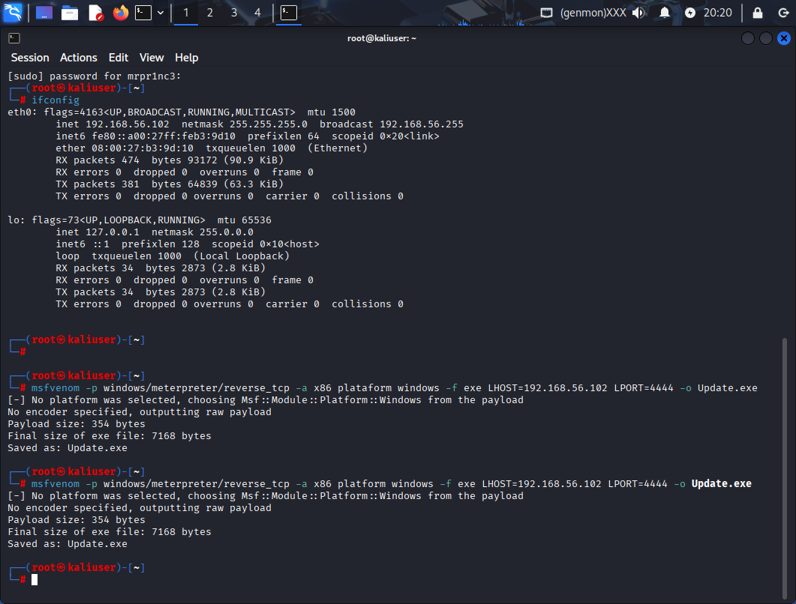
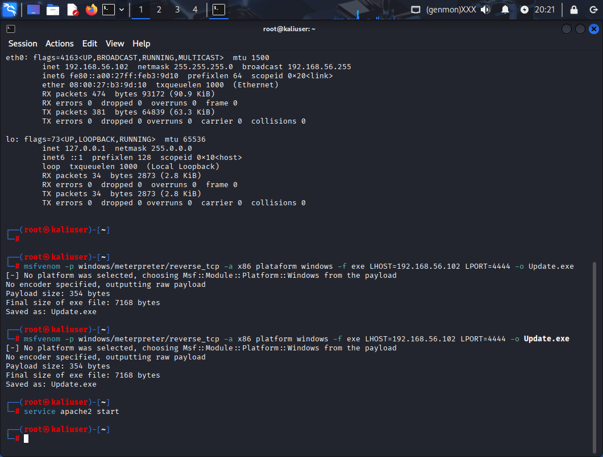
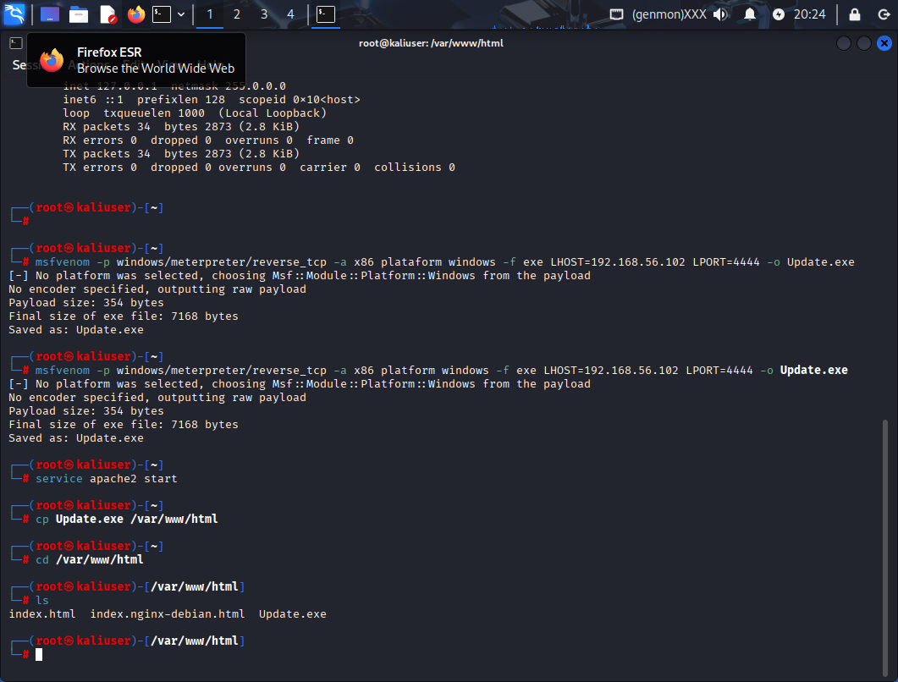
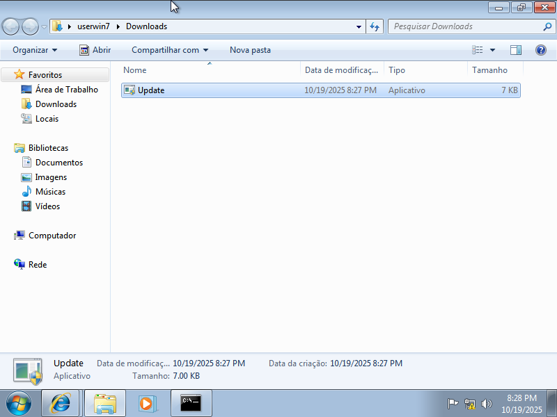
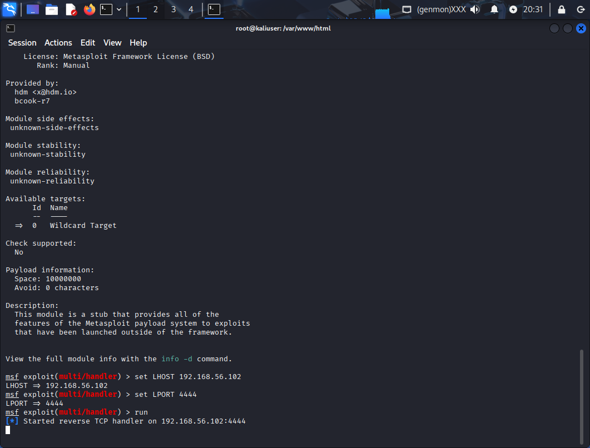
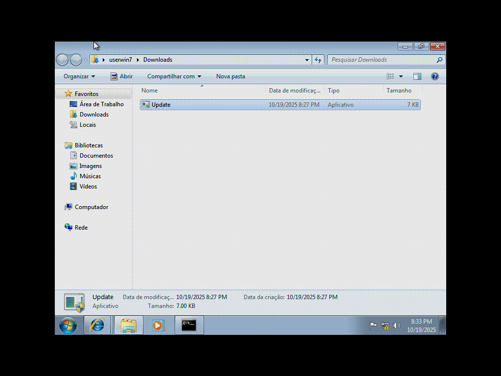

# add-backdoor-em-um-executavel
Adicionando Backdoor em um executavel

 

IP do alvo

 

Criando executavel com Backdoor no msfvenom

 

Subindo servidor Apache para o alvo baixar o executavel

 

Executavel online no servidor

 

Executavel baixado no alvo

 

Rodando Meterpreter e esperando alvo executar o backdoor

 

Alvo executando o aplicativo

 

Se conectando na maquina alvo apos ele executar o aplicativo

